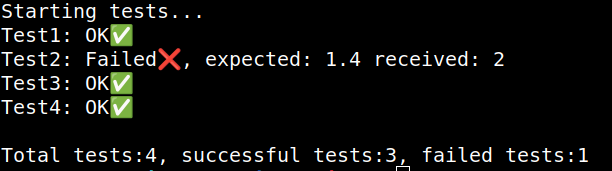

# Unit Test
a simple unit test library, so far only for testing as integers, floats and strings
### Example
```c
#include "../src/unit_test.h"

int	function1(int x)
{
	return (x + 1);
}

float	function2(float x)
{
	return (x + 1);
}

char	*function3(char *x)
{
	return (x);
}

void	tests(void)
{
	unit_test_equal_int(2, function1(1));
	unit_test_equal_float(1.4, function2(1));
	unit_test_not_equal_float(1.4, function2(1));
	unit_test_equal_string("test", function3("test"));
}

int	main(int argc, char *argv[])
{
	run_test(tests);
	return (0);
}
```

## Result

